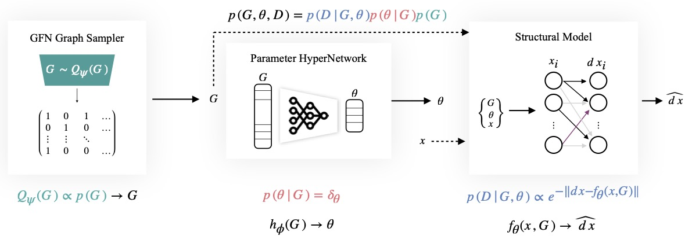

<div align="center">

# DynGFN: Bayesian Dynamic Causal Discovery using Generative Flow Networks

[](https://arxiv.org)
[](https://github.com/pre-commit/pre-commit)
[](https://pytorch.org/get-started/locally/)
[](https://pytorchlightning.ai/)
[](https://hydra.cc/)
[](https://black.readthedocs.io/en/stable/)
[](https://github.com/pre-commit/pre-commit)
[](https://github.com/lazaratan/dyn-gfn/blob/main/LICENSE)
<a href="https://github.com/ashleve/lightning-hydra-template"></a><br>

</div>



## Description

Generative Flow Networks (GFlowNets) are an approach for learning generative models over discrete spaces. GFlowNets learn a stochastic policy $P_F(\\tau)$ to sequentially sample an object $\\mathbf{x}$ (e.g. a graph) from a discrete space $\\mathcal{X}$. We propose a general framework for cyclic causal discovery of dynamic systems and use GFlowNets to learn dynamic causal structure. See [this http link](https://arxiv.org/) for the preprint.

DynGFN is method for learning cyclic causal structure of dynamic systems from observational time-series data. DynGFN consists of three components: (1) A graph sampler that samples graphical structure encoding the causal dependencies between variables, (2) A class of structural equation modules that models the functional relationships between the observed variables, indexed by parameters $\\theta$, and (3) A hyper-network architecture that outputs the parameters $\\theta$ of the structural equations as a function of the sampled graph, i.e. $\\theta = h\_{\phi}(G)$.

## How to run

Install dependencies

```bash
# clone project
git clone https://github.com/lazaratan/dyn-gfn.git
cd dyn-gfn

# [OPTIONAL] create conda environment
conda create -n myenv python=3.8
conda activate myenv

# install pytorch according to instructions
# https://pytorch.org/get-started/

# install requirements
pip install -r requirements.txt
```

Train model with default configuration

```bash
# train on CPU
python train.py trainer.gpus=0

# train on GPU
python train.py trainer.gpus=1
```

Train model with chosen experiment configuration from [configs/experiment/](configs/experiment/)

```bash
python train.py experiment=experiment_name.yaml
```

You can override any parameter from command line like this

```bash
python train.py trainer.max_epochs=20 datamodule.batch_size=64
```

## Project Structure

The directory structure of new project looks like this:

```
├── configs                   <- Hydra configuration files
│   ├── callbacks                <- Callbacks configs
│   ├── datamodule               <- Datamodule configs
│   ├── debug                    <- Debugging configs
│   ├── experiment               <- Experiment configs
│   ├── hparams_search           <- Hyperparameter search configs
│   ├── local                    <- Local configs
│   ├── log_dir                  <- Logging directory configs
│   ├── logger                   <- Logger configs
│   ├── model                    <- Model configs
│   ├── trainer                  <- Trainer configs
│   │
│   ├── test.yaml             <- Main config for testing
│   └── train.yaml            <- Main config for training
│
├── data                   <- Project data
│
├── logs                   <- Logs generated by Hydra and PyTorch Lightning loggers
│
├── notebooks              <- Jupyter notebooks. Naming convention is a number (for ordering),
│                             the creator's initials, and a short `-` delimited description,
│                             e.g. `1.0-jqp-initial-data-exploration.ipynb`.
│
├── scripts                <- Shell scripts
│
├── src                    <- Source code
│   ├── datamodules              <- Lightning datamodules
│   ├── models                   <- Lightning models
│   ├── utils                    <- Utility scripts
│   ├── vendor                   <- Third party code that cannot be installed using PIP/Conda
│   │
│   ├── testing_pipeline.py
│   └── training_pipeline.py
│
├── tests                  <- Tests of any kind
│   ├── helpers                  <- A couple of testing utilities
│   ├── shell                    <- Shell/command based tests
│   └── unit                     <- Unit tests
│
├── test.py               <- Run testing
├── train.py              <- Run training
│
├── .env.example              <- Template of the file for storing private environment variables
├── .gitignore                <- List of files/folders ignored by git
├── .pre-commit-config.yaml   <- Configuration of pre-commit hooks for code formatting
├── requirements.txt          <- File for installing python dependencies
├── setup.cfg                 <- Configuration of linters and pytest
└── README.md
```

</div>

### ⚡  Your Superpowers

<details>
<summary><b>Override any config parameter from command line</b></summary>

> Hydra allows you to easily overwrite any parameter defined in your config.

```bash
python train.py trainer.max_epochs=20 model.lr=1e-4
```

> You can also add new parameters with `+` sign.

```bash
python train.py +model.new_param="uwu"
```

</details>

<details>
<summary><b>Train on CPU, GPU, multi-GPU and TPU</b></summary>

> PyTorch Lightning makes it easy to train your models on different hardware.

```bash
# train on CPU
python train.py trainer.gpus=0

# train on 1 GPU
python train.py trainer.gpus=1

# train on TPU
python train.py +trainer.tpu_cores=8

# train with DDP (Distributed Data Parallel) (4 GPUs)
python train.py trainer.gpus=4 +trainer.strategy=ddp

# train with DDP (Distributed Data Parallel) (8 GPUs, 2 nodes)
python train.py trainer.gpus=4 +trainer.num_nodes=2 +trainer.strategy=ddp
```

</details>

<details>
<summary><b>Train with mixed precision</b></summary>

```bash
# train with pytorch native automatic mixed precision (AMP)
python train.py trainer.gpus=1 +trainer.precision=16
```

</details>

<!-- deepspeed support still in beta
<details>
<summary><b>Optimize large scale models on multiple GPUs with Deepspeed</b></summary>

```bash
python train.py +trainer.
```

</details>
 -->

<details>
<summary><b>Train model with any logger available in PyTorch Lightning, like Weights&Biases or Tensorboard</b></summary>

> PyTorch Lightning provides convenient integrations with most popular logging frameworks, like Tensorboard, Neptune or simple csv files. Read more [here](#experiment-tracking). Using wandb requires you to [setup account](https://www.wandb.com/) first. After that just complete the config as below.<br> > **Click [here](https://wandb.ai/hobglob/template-dashboard/) to see example wandb dashboard generated with this template.**

```bash
# set project and entity names in `configs/logger/wandb`
wandb:
  project: "your_project_name"
  entity: "your_wandb_team_name"
```

```bash
# train model with Weights&Biases (link to wandb dashboard should appear in the terminal)
python train.py logger=wandb
```

</details>

<details>
<summary><b>Train model with chosen experiment config</b></summary>

> Experiment configurations are placed in [configs/experiment/](configs/experiment/).

```bash
python train.py experiment=example
```

</details>

<details>
<summary><b>Attach some callbacks to run</b></summary>

> Callbacks can be used for things such as as model checkpointing, early stopping and [many more](https://pytorch-lightning.readthedocs.io/en/latest/extensions/callbacks.html#built-in-callbacks).<br>
> Callbacks configurations are placed in [configs/callbacks/](configs/callbacks/).

```bash
python train.py callbacks=default
```

</details>

<details>
<summary><b>Use different tricks available in Pytorch Lightning</b></summary>

> PyTorch Lightning provides about [40+ useful trainer flags](https://pytorch-lightning.readthedocs.io/en/latest/common/trainer.html#trainer-flags).

```yaml
# gradient clipping may be enabled to avoid exploding gradients
python train.py +trainer.gradient_clip_val=0.5

# stochastic weight averaging can make your models generalize better
python train.py +trainer.stochastic_weight_avg=true

# run validation loop 4 times during a training epoch
python train.py +trainer.val_check_interval=0.25

# accumulate gradients
python train.py +trainer.accumulate_grad_batches=10

# terminate training after 12 hours
python train.py +trainer.max_time="00:12:00:00"
```

</details>

<details>
<summary><b>Easily debug</b></summary>

> Visit [configs/debug/](configs/debug/) for different debugging configs.

```bash
# runs 1 epoch in default debugging mode
# changes logging directory to `logs/debugs/...`
# sets level of all command line loggers to 'DEBUG'
# enables extra trainer flags like tracking gradient norm
# enforces debug-friendly configuration
python train.py debug=default

# runs test epoch without training
python train.py debug=test_only

# run 1 train, val and test loop, using only 1 batch
python train.py +trainer.fast_dev_run=true

# raise exception if there are any numerical anomalies in tensors, like NaN or +/-inf
python train.py +trainer.detect_anomaly=true

# print execution time profiling after training ends
python train.py +trainer.profiler="simple"

# try overfitting to 1 batch
python train.py +trainer.overfit_batches=1 trainer.max_epochs=20

# use only 20% of the data
python train.py +trainer.limit_train_batches=0.2 \
+trainer.limit_val_batches=0.2 +trainer.limit_test_batches=0.2

# log second gradient norm of the model
python train.py +trainer.track_grad_norm=2
```

</details>

<details>
<summary><b>Resume training from checkpoint</b></summary>

> Checkpoint can be either path or URL.

```yaml
python train.py trainer.resume_from_checkpoint="/path/to/ckpt/name.ckpt"
```

> ⚠️ Currently loading ckpt in Lightning doesn't resume logger experiment, but it will be supported in future Lightning release.

</details>

<details>
<summary><b>Execute evaluation for a given checkpoint</b></summary>

> Checkpoint can be either path or URL.

```yaml
python test.py ckpt_path="/path/to/ckpt/name.ckpt"
```

</details>

<details>
<summary><b>Create a sweep over hyperparameters</b></summary>

```bash
# this will run 6 experiments one after the other,
# each with different combination of batch_size and learning rate
python train.py -m datamodule.batch_size=32,64,128 model.lr=0.001,0.0005
```

> ⚠️ This sweep is not failure resistant (if one job crashes than the whole sweep crashes).

</details>

<details>
<summary><b>Create a sweep over hyperparameters with Optuna</b></summary>

> Using [Optuna Sweeper](https://hydra.cc/docs/next/plugins/optuna_sweeper) plugin doesn't require you to code any boilerplate into your pipeline, everything is defined in a [single config file](configs/hparams_search/mnist_optuna.yaml)!

```bash
# this will run hyperparameter search defined in `configs/hparams_search/mnist_optuna.yaml`
# over chosen experiment config
python train.py -m hparams_search=mnist_optuna experiment=example_simple
```

> ⚠️ Currently this sweep is not failure resistant (if one job crashes than the whole sweep crashes). Might be supported in future Hydra release.

</details>

<details>
<summary><b>Execute all experiments from folder</b></summary>

> Hydra provides special syntax for controlling behavior of multiruns. Learn more [here](https://hydra.cc/docs/next/tutorials/basic/running_your_app/multi-run). The command below executes all experiments from folder [configs/experiment/](configs/experiment/).

```bash
python train.py -m 'experiment=glob(*)'
```

</details>

<details>
<summary><b>Execute sweep on a remote AWS cluster</b></summary>

> This should be achievable with simple config using [Ray AWS launcher for Hydra](https://hydra.cc/docs/next/plugins/ray_launcher). Example is not yet implemented in this template.

</details>

<!-- <details>
<summary><b>Execute sweep on a SLURM cluster</b></summary>

> This should be achievable with either [the right lightning trainer flags](https://pytorch-lightning.readthedocs.io/en/latest/clouds/cluster.html?highlight=SLURM#slurm-managed-cluster) or simple config using [Submitit launcher for Hydra](https://hydra.cc/docs/plugins/submitit_launcher). Example is not yet implemented in this template.

</details> -->

<details>
<summary><b>Use Hydra tab completion</b></summary>

> Hydra allows you to autocomplete config argument overrides in shell as you write them, by pressing `tab` key. Learn more [here](https://hydra.cc/docs/tutorials/basic/running_your_app/tab_completion).

</details>

<details>
<summary><b>Apply pre-commit hooks</b></summary>

> Apply pre-commit hooks to automatically format your code and configs, perform code analysis and remove output from jupyter notebooks. See [# Best Practices](#best-practices) for more.

```bash
pre-commit run -a
```

</details>

<br>

## ❤️  Contributions

Have a question? Found a bug? Missing a specific feature? Feel free to file a new issue, discussion or PR with respective title and description.

Before making an issue, please verify that:

- The problem still exists on the current `main` branch.
- Your python dependencies are updated to recent versions.

Suggestions for improvements are always welcome!

<br>

## License

This project is licensed under the MIT License.

```
MIT License

Copyright (c) 2023 Lazar Atanackovic

Permission is hereby granted, free of charge, to any person obtaining a copy
of this software and associated documentation files (the "Software"), to deal
in the Software without restriction, including without limitation the rights
to use, copy, modify, merge, publish, distribute, sublicense, and/or sell
copies of the Software, and to permit persons to whom the Software is
furnished to do so, subject to the following conditions:

The above copyright notice and this permission notice shall be included in all
copies or substantial portions of the Software.

THE SOFTWARE IS PROVIDED "AS IS", WITHOUT WARRANTY OF ANY KIND, EXPRESS OR
IMPLIED, INCLUDING BUT NOT LIMITED TO THE WARRANTIES OF MERCHANTABILITY,
FITNESS FOR A PARTICULAR PURPOSE AND NONINFRINGEMENT. IN NO EVENT SHALL THE
AUTHORS OR COPYRIGHT HOLDERS BE LIABLE FOR ANY CLAIM, DAMAGES OR OTHER
LIABILITY, WHETHER IN AN ACTION OF CONTRACT, TORT OR OTHERWISE, ARISING FROM,
OUT OF OR IN CONNECTION WITH THE SOFTWARE OR THE USE OR OTHER DEALINGS IN THE
SOFTWARE.
```

<br>
